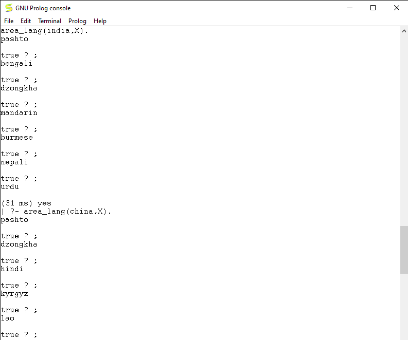
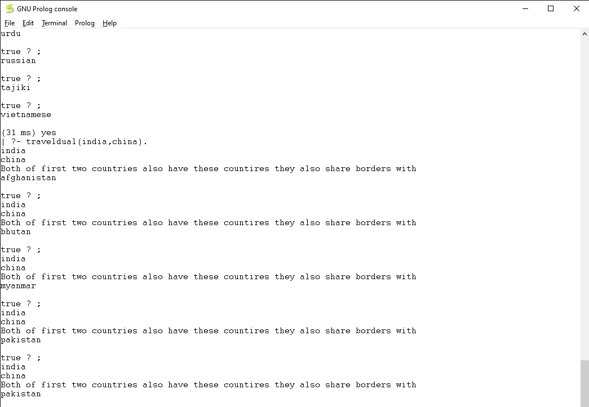
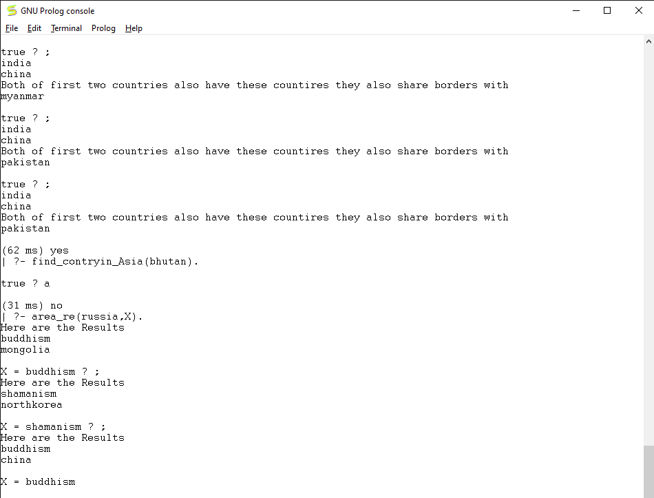

## Allows you to figure out which countries surround one another also find the languages, religions neighboring a
## given country.

### Example 1 
#### Let's say you want to know all the language's around india 

### Example 2
#### checks if two countries have the same country as their neighbor 

### Example 3
#### This shows a function that shows all the religions surrounding a given country 
